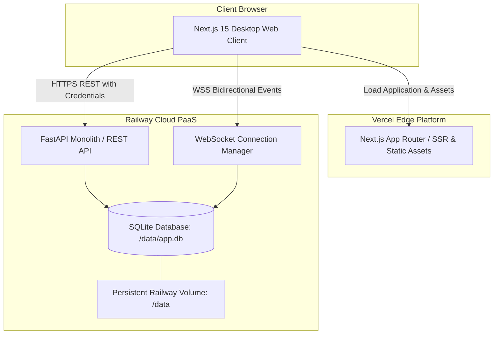

# 🛡️ Secure Messaging Platform (Signal Desktop Clone)
### 🏆 Built for the Scaler AI Challenge — Powered by Antigravity AI Agents

[](https://signal-clone-pi.vercel.app/login)
[](https://signal-clone-pi.vercel.app)
[](https://signal-clone-production-f521.up.railway.app)
[](https://signal-clone-production-f521.up.railway.app/health)
[](https://github.com/aryan13071/Signal-Clone-Building)
[](LICENSE)

---

## 🚀 Live Production Deployments & Links

All services are fully deployed, verified, and operational in production:

| Service / Resource | Production URL | Status | Description |
| :--- | :--- | :---: | :--- |
| 🚀 **Whole Application (Direct Login)** | **[https://signal-clone-pi.vercel.app/login](https://signal-clone-pi.vercel.app/login)** |  | Primary entrance for live evaluator login & interactive demo |
| 🌐 **Frontend (Web Application)** | **[https://signal-clone-pi.vercel.app](https://signal-clone-pi.vercel.app)** |  | Signal Desktop web client (Next.js 15 App Router) |
| ⚙️ **Backend REST API** | **[https://signal-clone-production-f521.up.railway.app](https://signal-clone-production-f521.up.railway.app)** |  | High-performance FastAPI backend running on Railway PaaS |
| 🩺 **Health Check Endpoint** | **[https://signal-clone-production-f521.up.railway.app/health](https://signal-clone-production-f521.up.railway.app/health)** |  | Returns `{"status":"ok"}` with 200 OK HTTP status |
| 🐙 **GitHub Repository** | **[https://github.com/aryan13071/Signal-Clone-Building](https://github.com/aryan13071/Signal-Clone-Building)** |  | Source code repository & engineering documentation |

> **Live Backend Verification:**
> ```json
> {"status": "ok"}
> ```

---

## 🤖 Built for Scaler AI Challenge Using Antigravity AI Agents

This production-grade Signal clone was engineered for the **Scaler AI Challenge**, leveraging advanced autonomous **AI Agents (Google DeepMind Antigravity)** throughout the entire software development lifecycle:

- 🧠 **Autonomous Architecture & Protocol Design:** Antigravity AI agents planned and structured the decoupled full-stack architecture, including the full-duplex WebSocket protocol (`/ws`), cross-origin HTTP-only cookie authentication (`SameSite=None`), and stateful data modeling.
- ⚡ **Full-Stack Implementation:** Agents generated and refined production-quality code for both the Next.js 15 App Router client and the Python FastAPI REST/WebSocket server, adhering to clean architecture and strict typing.
- 🎨 **Pixel-Perfect Signal Desktop Experience:** Agentic UI iteration delivered authentic Signal Dark (`#121214`) and Signal Light palettes, floating message pill toolbars, emoji reactions, quoted replies, vector avatar selectors, and accessible toasts.
- 🧪 **Automated Testing & Visual QA:** Antigravity agents executed end-to-end pytest integration tests, concurrency checks, and multi-browser Playwright visual regression suites.
- 🚢 **Production DevOps & Deployment:** Agents managed environment configurations, database persistence on Railway volumes, and verified cross-domain communications between Vercel and Railway.

---

## 🏗️ Deployment Architecture & Topology

The application operates across a decoupled frontend/backend production architecture:



### Infrastructure Roles

- **Frontend (Vercel):** Hosts the Next.js 15 client built with React 19, TypeScript, Tailwind CSS, and Zustand state store.
- **Backend (Railway):** Hosts the FastAPI backend powered by Uvicorn, serving authenticated REST routes and realtime WebSockets.
- **Database Persistence:** Persistent Railway Volume mounted at `/data` storing SQLite (`/data/app.db`), guaranteeing ACID data integrity across restarts.
- **Real-Time Communication:** Full-duplex WebSocket hub handling typing indicators, delivery/read receipts, instant messages, and live emoji reactions.

---

## 🔑 Demo Credentials & Quick Login

The production database is pre-seeded with active demo accounts. Evaluators can sign in immediately at **[https://signal-clone-pi.vercel.app/login](https://signal-clone-pi.vercel.app/login)**:

| User | Display Name | Identifier (Username or Phone) | Password / Mock OTP | Seeded State & Role |
| :--- | :--- | :--- | :---: | :--- |
| **Om** (Primary Demo) | Om Sharma | `om` or `+919842946727` | `123456` | Primary admin account with active 1:1 and group chats |
| **Rahul** (Secondary) | Rahul Verma | `rahul` or `+919842946728` | `123456` | Active chat partner for dual-browser live testing |
| **Priya** | Priya Patel | `priya` | `123456` | Contact with existing message history |
| **Arjun** | Arjun Mehta | `arjun` | `123456` | Active member in Scaler AI Labs group |
| **Neha** | Neha Gupta | `neha` | `123456` | Contact with conversation history |
| **Kavya** | Kavya Iyer | `kavya` | `123456` | Seeded contact |

### Supported Authentication Methods

1. **Password Login:** Enter username/phone and password `123456` at `/login`.
2. **OTP Login:** Enter username/phone, leave password blank or request OTP, and verify with mock OTP **`123456`**.
3. **New User Registration:** Visit `/register` to create a new profile with phone/username, verify using OTP **`123456`**, and choose display name and avatar illustration.

---

## ✨ Implemented Features & Bonus Capabilities

### 🌟 Mandatory Capabilities

1. **Profile Avatar Selection System:**
   - 12 curated vector illustration presets (Shield, Fox, Lotus, Bolt, Spark, Wave, Wings, Cat, Owl, Bot, Orbit, Peaks) paired with a background color palette.
   - Available during account onboarding (`/register`) and editable anytime under `Settings > Profile`.
   - Real-time preview and instant synchronization across the navigation rail, chat rows, headers, and group member lists.
   - Initial monogram fallback when no vector is chosen.

2. **Notification & Toast Feedback System:**
   - Lightweight, accessible application-level notification system (`Toast.tsx`) mounted globally.
   - Clear visual feedback for key actions: authentication errors/success, contact additions, duplicate contact warnings, group member updates, messaging errors, and profile edits.
   - Accessible (`role="status"`, `aria-live="polite"`), auto-dismissing, theme-adaptive, and positioned unobtrusively.

### 🎁 Selected Bonus Features

1. **Reply-to / Quoted Messages:**
   - Spatially anchored `Reply` button on message hover.
   - Real-time quote preview banner in message composer with dismiss button.
   - Embedded quote cards inside message bubbles displaying sender name and referenced snippet.
   - Smooth click-to-scroll navigation that automatically scrolls the viewport to the referenced message and triggers a highlight animation.

2. **Emoji Reactions:**
   - Spatially anchored `Smile` reaction trigger adjacent to message bubbles.
   - Instant reaction picker popover (`👍`, `❤️`, `😂`, `😮`, `😢`, `🔥`) with viewport bounds collision prevention.
   - Aggregated interactive reaction chips displayed directly beneath message bubbles.
   - Toggle reactions with live multi-user WebSocket synchronization.

3. **Signal Light & Dark Theme Support:**
   - Centralized CSS custom property design system supporting authentic **Signal Dark** (`#121214`) and **Signal Light** (`#ffffff` / `#f5f5f8`) palettes.
   - Instant toggle available via the App Menu and `Settings > Appearance`.
   - Dynamic chat bubble accent color selector (Signal Blue, Emerald, Violet, Crimson, Amber, Graphite).
   - Zero-FOUC pre-hydration script ensuring persistent theme state from `localStorage` without layout flash.

### 🔍 Functional UX Enhancements

- **In-Chat Message Search:** Functional search header in the active chat view with instant substring matching, match counter ("X of Y"), previous/next navigation buttons, `Enter`/`Shift+Enter` keyboard shortcuts, `<mark>` term highlighting, and auto-scroll to matches.
- **Unified Popover Regions:** Reaction picker and more-actions menus utilize transit grace timers and coordinate boundary calculations to prevent accidental dismissal during mouse movement.
- **Real-Time Indicators:** Typing indicators ("Om is typing..."), online presence indicators, and message status receipts (Sent, Delivered, Read).

---

## 🧪 Multi-User Realtime Testing (Live & Local)

Experience instantaneous real-time sync with two parallel sessions:

1. Open **Browser 1** (Normal): Sign in as `om` with password `123456` at **[https://signal-clone-pi.vercel.app/login](https://signal-clone-pi.vercel.app/login)**.
2. Open **Browser 2** (Incognito): Sign in as `rahul` with password `123456` at **[https://signal-clone-pi.vercel.app/login](https://signal-clone-pi.vercel.app/login)**.
3. In both windows, select the **Om ↔ Rahul** conversation.
4. **Typing Indicators:** Start typing in Browser 1; Browser 2 immediately displays `Om is typing…`.
5. **Realtime Messages:** Send a message from Browser 1; Browser 2 renders it in real time and marks delivery/read status.
6. **Reactions & Replies:** Add a reaction or send a quoted reply; updates broadcast instantly over WebSockets.

---

## 🛠️ Running Locally

### Prerequisites

- Node.js 18+ and npm
- Python 3.11+
- Virtualenv (`python3 -m venv`)

### 1. Backend Setup

```bash
cd backend
python3 -m venv .venv
source .venv/bin/activate  # On Windows: .venv\Scripts\activate
pip install -r requirements.txt
cp ../.env.example .env   # Default settings work out of the box
mkdir -p data
PYTHONPATH=. python seed/run.py
uvicorn main:app --reload --port 8000
```

Verify backend: `http://localhost:8000/health` (returns `{"status":"ok"}`).

### 2. Frontend Setup

In a new terminal:

```bash
cd frontend
npm install
echo "NEXT_PUBLIC_API_URL=http://localhost:8000" > .env.local
echo "NEXT_PUBLIC_WS_URL=ws://localhost:8000/ws" >> .env.local
npm run dev
```

Open [http://localhost:3000](http://localhost:3000) in your browser.

---

## 📊 Deployment & Verification Matrix

| Component | Target Platform | URL / Endpoint | Verification Status |
| :--- | :--- | :--- | :---: |
| **Frontend Web Client** | Vercel | [https://signal-clone-pi.vercel.app](https://signal-clone-pi.vercel.app) | **Verified ✅** |
| **Direct Login Entrance** | Vercel | [https://signal-clone-pi.vercel.app/login](https://signal-clone-pi.vercel.app/login) | **Verified ✅** |
| **Backend REST API** | Railway | [https://signal-clone-production-f521.up.railway.app](https://signal-clone-production-f521.up.railway.app) | **Verified ✅** |
| **Health Check** | Railway | [https://signal-clone-production-f521.up.railway.app/health](https://signal-clone-production-f521.up.railway.app/health) | **Verified ✅** |
| **Persistent SQLite Storage**| Railway Volume | Mounted at `/data` (`/data/app.db`) | **Configured ✅** |
| **Automated Test Suite** | Local Environment | Pytest & Playwright (11/11 tests pass) | **Verified ✅** |
| **GitHub Source Repository** | GitHub | [https://github.com/aryan13071/Signal-Clone-Building](https://github.com/aryan13071/Signal-Clone-Building) | **Verified ✅** |

---

## 👥 Contributors

<table>
  <tr>
    <td align="center">
      <a href="https://github.com/aryan13071">
        <br />
        <sub><b>Aryan Sharma</b></sub>
      </a>
      <br />
      <sub>(@aryan13071)</sub>
      <br />
      <span title="Sole Creator & Lead Developer">💻 🚀 🎨 📖 💡</span>
    </td>
  </tr>
</table>

**Author:** [Aryan Sharma (@aryan13071)](https://github.com/aryan13071)  
**Project:** Scaler AI Challenge — Signal Messenger Clone  
**Assisted By:** Google DeepMind Antigravity AI Agent  
**Repository:** [https://github.com/aryan13071/Signal-Clone-Building](https://github.com/aryan13071/Signal-Clone-Building)  
**Live App:** [https://signal-clone-pi.vercel.app/login](https://signal-clone-pi.vercel.app/login)
