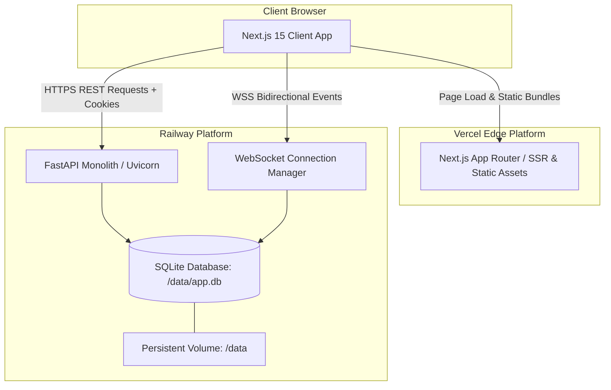
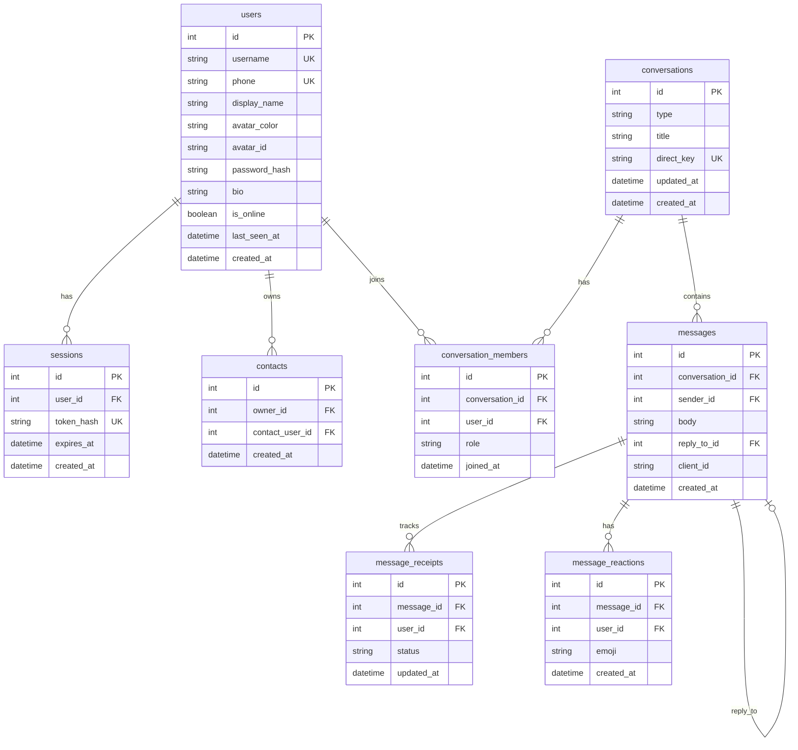

# Architecture — Signal Clone

## 1. System & Deployment Topology

The application is deployed across a decoupled frontend/backend production architecture:



### Production Hosting Roles

- **Frontend:** Deployed to **Vercel** (`https://signal-clone-pi.vercel.app`). Serves the Next.js 15 App Router static assets and client-side application.
- **Backend:** Deployed to **Railway** (`https://signal-clone-production-f521.up.railway.app`). Runs a unified FastAPI monolith handling REST endpoints and WebSocket connections on a single port.
- **Database:** SQLite deployed directly on Railway with a persistent volume mounted at `/data` (`DATABASE_URL=sqlite:////data/app.db`), guaranteeing ACID data persistence across deploys and container restarts.
- **Realtime Layer:** In-memory `ConnectionManager` routing events directly between active WebSockets without external brokers (Redis), keeping operational overhead minimal for a single-node deployment.

---

## 2. Authentication & Session Cookie Architecture

The application implements a secure, cross-origin session cookie architecture:

```mermaid
sequenceDiagram
  autonumber
  actor User as User Browser
  participant FE as Vercel (Frontend)
  participant BE as Railway (FastAPI)
  participant DB as SQLite (/data/app.db)

  User->>FE: Navigate to /login
  User->>BE: POST /api/auth/login/password (or verify-otp)
  BE->>DB: Validate user & generate crypto session token
  BE->>DB: Store token hash in sessions table (14-day expiry)
  BE-->>User: 200 OK + Set-Cookie: session_token=<token>; HttpOnly; Secure; SameSite=None
  User->>BE: GET /api/auth/me (with credentials: "include")
  BE->>DB: Validate session_token hash
  BE-->>User: 200 OK + UserPublic profile
  User->>BE: WSS Handshake /ws (cookie included or ?token=)
  BE-->>User: 101 Switching Protocols (Connection established)
```

### Security Configuration

- **`HttpOnly=True`:** The `session_token` cookie cannot be read by clientside JavaScript (`document.cookie`), mitigating XSS-based session hijacking.
- **`Secure=True`:** Enforced in production so the cookie is only transmitted over HTTPS connections.
- **`SameSite=None`:** Required for cross-origin credential passing between the Vercel frontend domain (`https://signal-clone-pi.vercel.app`) and the Railway backend domain (`https://signal-clone-production-f521.up.railway.app`). In local development, `SameSite=Lax` and `Secure=False` are used.
- **CORS Allow Credentials:** FastAPI's `CORSMiddleware` is configured with `allow_origins=[CORS_ORIGINS]`, `allow_credentials=True`, `allow_methods=["*"]`, and `allow_headers=["*"]`. The production origin is strictly set to `https://signal-clone-pi.vercel.app`.
- **Token Hashing:** Raw session tokens issued to clients are hashed using SHA-256 before storage in the database `sessions` table.

---

## 3. Frontend Architecture

```
frontend/
├── app/
│   ├── (app)/
│   │   ├── calls/page.tsx               # Voice & video calls product surface
│   │   ├── chats/page.tsx               # Chat overview / default landing
│   │   ├── chats/[id]/page.tsx          # Active thread with ChatPane
│   │   ├── settings/[[...section]]/     # Modular Signal settings subsections
│   │   ├── stories/page.tsx             # Stories surface ("My Story", recent updates)
│   │   └── layout.tsx                   # App shell wrapper
│   ├── login/page.tsx                   # Signal login (password & OTP support)
│   ├── register/page.tsx                # Multi-step registration flow
│   ├── globals.css                      # Centralized CSS design tokens (Dark & Light)
│   └── layout.tsx                       # Root layout with ThemeProvider & inline theme script
├── components/
│   ├── layout/
│   │   ├── MessengerShell.tsx           # Responsive layout: NavRail + sidebar + chat pane
│   │   └── NavRail.tsx                  # Signal navigation rail with user menu & status
│   ├── providers/
│   │   └── ThemeProvider.tsx            # Theme state management & localStorage sync
│   └── ui/
│       ├── Avatar.tsx                   # User avatar with initial & dynamic color badge
│       └── ComingSoon.tsx               # Placeholder surface component
├── features/
│   ├── auth/                            # LoginForm & RegisterForm components
│   ├── conversations/                   # ChatsSidebar, ConversationList, NewChatView
│   ├── messaging/                       # ChatPane, MessageBubble, MessageStatus, MessageSearch
│   └── settings/                        # SettingsView (Appearance, Profile, Chats, Privacy, etc.)
├── hooks/
│   └── use-realtime.ts                  # WebSocket event synchronization & receipt handler
├── lib/
│   ├── api.ts                           # Typed HTTP client wrapper with credentials: "include"
│   └── config.ts                        # URL resolution for NEXT_PUBLIC_API_URL & NEXT_PUBLIC_WS_URL
├── store/
│   └── app-store.ts                     # Zustand store (active thread, user, theme, chat color)
└── types/
    └── index.ts                         # Shared TypeScript interfaces
```

### Key UI Subsystems

1. **Theme System:**
   - Centralized CSS variables in `globals.css` with `:root` / `[data-theme="dark"]` (default) and `[data-theme="light"]`.
   - Dynamic accent color customization (`--bubble-out`) saved in `localStorage`.
   - Pre-hydration blocking script in `layout.tsx` eliminates flash of unstyled content (FOUC).

2. **Spatially Anchored Message Interactions:**
   - Actions toolbar (`Smile`, `Reply`, `More`) is anchored directly adjacent to the message bubble on hover (adapts to left for outgoing, right for incoming).
   - Unified popover regions with grace timers to eliminate accidental dismissal during cursor transit.
   - Reaction picker displays directly above the bubble.
   - Aggregated reaction chips render directly beneath the message bubble with interactive user toggling.

3. **In-Chat Message Search:**
   - Independent of sidebar conversation search.
   - Real-time substring matching with navigation buttons (`Prev` / `Next`), keyboard shortcuts (`Enter`/`Shift+Enter`), and hit counter (`X of Y`).
   - `<mark>` term highlighting in message bubbles and smooth auto-scroll to matching messages.

4. **Quoted Replies:**
   - Reply composer preview with accent border and dismiss button.
   - Embedded quote card inside message bubbles with sender name and truncated text.
   - Click-to-scroll navigation jumping to the referenced message with temporary highlight animation.

5. **State Management & Realtime Sync:**
   - **Zustand (`store/app-store.ts`):** Single source of truth for current user, active conversation, thread list, messages, draft quotes, search state, and UI theme.
   - **`use-realtime.ts`:** Handles WebSocket connection lifecycle, automatic reconnection, heartbeat pings (`presence.ping`), conversation room subscriptions, and incoming event dispatching.

---

## 4. Backend Architecture

```
backend/
├── app/
│   ├── api/
│   │   └── routes.py         # REST route endpoints (auth, conversations, messages, contacts)
│   ├── auth/
│   │   ├── deps.py           # Cookie session dependency & token verification
│   │   ├── passwords.py      # PBKDF2 password hashing & verification
│   │   └── tokens.py         # Crypto tokens & SHA-256 hash helpers
│   ├── core/
│   │   ├── config.py         # Pydantic Settings (env loading & defaults)
│   │   └── time_utils.py     # UTC timestamp helpers
│   ├── database/
│   │   └── session.py        # SQLAlchemy engine, SessionLocal, get_db generator
│   ├── models/
│   │   └── entities.py       # SQLAlchemy ORM mapped entities
│   ├── repositories/
│   │   ├── conversation_repo.py  # Conversation & member database queries
│   │   ├── message_repo.py       # Message, receipt, and reaction database queries
│   │   └── user_repo.py          # User, contact, and session database queries
│   ├── schemas/
│   │   └── common.py         # Pydantic models for request/response validation (DTOs)
│   ├── services/
│   │   ├── auth_service.py         # Registration, OTP, login, and session lifecycle
│   │   ├── conversation_service.py # Direct/group creation, member admin ops, search
│   │   └── message_service.py      # Message delivery, read receipts, reactions, quotes
│   └── websocket/
│       ├── handlers.py       # WebSocket connection loop & inbound event handler
│       └── manager.py        # ConnectionManager (socket pooling, rooms, broadcast)
├── data/                     # Local SQLite database directory (.gitignore'd)
├── seed/
│   ├── run.py                # Database seeding runner (seed_if_empty)
│   └── seed_data.py          # Deterministic seed data (users, chats, messages, replies)
├── tests/
│   ├── test_api.py           # Basic API route test suite
│   ├── test_full_suite.py    # Comprehensive REST & integration tests
│   └── visual_qa.py          # Playwright automated visual & multi-user testing
├── main.py                   # FastAPI app creation, CORS middleware, lifespan
├── Procfile                  # Railway / production process definition
└── railway.toml              # Railway build & deploy configuration
```

### Layered Separation of Concerns

- **Routes (`app/api/`):** Request validation, dependency injection (`get_db`, `get_current_user`), and HTTP response generation.
- **Services (`app/services/`):** Business logic, transaction boundaries, receipt tracking, and authorization rules.
- **Repositories (`app/repositories/`):** Encapsulated SQLAlchemy database queries.
- **Models (`app/models/entities.py`):** SQLAlchemy ORM entity definitions.

---

## 5. Database Schema & Entities



### Data Integrity & Constraints

- **ACID Transactions:** Full ACID compliance guaranteed by SQLite with WAL mode.
- **Unique Constraints:**
  - `(owner_id, contact_user_id)` prevents duplicate contacts.
  - `(conversation_id, user_id)` prevents duplicate group memberships.
  - `(message_id, user_id)` on `message_reactions` enforces one reaction per user per message (with toggle/update behavior).
  - `(message_id, user_id)` on `message_receipts` tracks per-recipient delivery and read states.
  - `direct_key` (`min_id:max_id`) guarantees exactly one direct conversation exists between any two users.
- **Message Lifecycle:** Defaults to `sent`, transitions to `delivered` when recipient client acknowledges, and to `read` when thread is viewed.
- **Group Authorization:** Only members with `role = "admin"` can add or remove members from group conversations.

---

## 6. Avatar, Toast Feedback & Linked Devices Architecture

### A. Profile Avatar Architecture
- **Preset Representation:** Avatars are represented as curated vector identifiers (`avatar_id`, e.g., `"shield"`, `"fox"`, `"lotus"`, `"bolt"`, `"spark"`, `"wave"`, `"phoenix"`, `"cat"`, `"owl"`, `"bot"`, `"orbit"`, `"mountain"`) coupled with an accent background color (`avatar_color`).
- **Persistence Model:** Minimally stored directly in the `users` table via `avatar_id VARCHAR(32)` and `avatar_color VARCHAR(16)`. Persisted upon onboarding completion (`POST /api/auth/register/complete`) and profile updates (`PATCH /api/auth/me`). Avoids bulky, unneeded third-party image upload storage.
- **Rendering & Source of Truth:** `Avatar.tsx` acts as the uniform component across the application (nav rail, conversation items, chat headers, settings). It checks `getAvatarPreset(user.avatar_id)` to render the corresponding SVG vector glyph, with automatic fallback to the monogram initial of `user.display_name`.

### B. Global Toast Feedback Architecture
- **State Architecture:** Managed globally via a lightweight Zustand store (`Toast.tsx`), decoupling notification triggering from component hierarchies.
- **Mount Point:** Mounted once in root `app/layout.tsx` (`<ToastContainer />`), positioned at the bottom-right corner of the desktop viewport without obscuring composer actions or navigation rails.
- **Triggering Points:** Invoked through the `useToast()` hook (`success`, `error`, `info`, `warning`) across meaningful operations:
  - Auth: login failures, registration errors/success.
  - Contacts: contact added, duplicate contact warnings.
  - Groups: group creation, member added/removed, permission denied alerts.
  - Messaging: network/send error notifications.
  - Settings: profile/avatar updates, safety number clipboard copy.
- **Accessibility & UX:** Configured with `role="status"` and `aria-live="polite"` for non-disruptive screen reader announcements. Includes auto-dismiss timers, manual dismiss buttons, entrance animations, and solid theme-aware backdrops for zero text bleed-through.

### C. Linked Devices Surface (Placeholder Architecture)
- **Deliberately UI-Only:** Resides at `/settings/linked-devices` within the Signal Settings hierarchy.
- **Clean Representation:** Accurately renders the current desktop session ("This Device • Connected") and an informational placeholder describing secondary phone/desktop QR pairing.
- **Zero Synthetic Logic:** Avoids fake device rows, dummy WebSocket pairing messages, or artificial database device tables, strictly respecting assignment boundaries.


